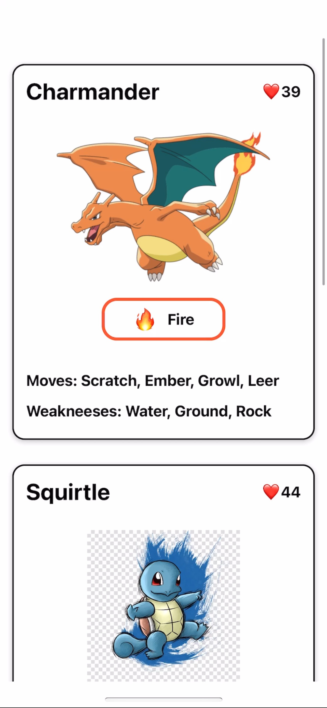

# LEARNING BASIC REACT NATIVE

###

# 1.React Native Tutorial - 1 - Introduction

## One Stop Shop For React

### a. React Fundamentals & Advanced Topics

### b. React Hooks

### c. React Typescipt

### d. React Redux

### e. React Router

### f. React Testing

### g. React Meterial UI

### h. React Styled Components

### ...

# 2. Expo vs ReactNative

###

# 3. Build Mini Project: Pokemon Card

